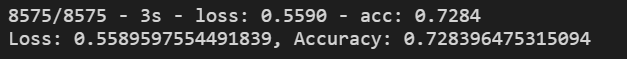
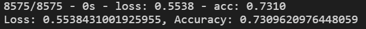
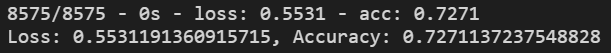

# Neural_Network_Charity_Analysis

## Overview
Create a binary classifier that is capable of predicting whether applicants will be successful if funded by Alphabet Soup. With the given data set, machine learning and neural networks will be applied using the Tensorflow library.

## Results

-*What variable(s) are considered the target(s) for your model?*  
The IS_SUCCESSFUL will be the target to capture the binary value.  

-*What variable(s) are considered to be the features for your model?*  
The features of the model are APPLICATION_TYPE, AFFILIATION, CLASSIFICATION, USE_CASE, ORGANIZATION, INCOME_AMT, and ASK_AMT. With the categorical features converted to encoded numerical values.  

-*What variable(s) are neither targets nor features, and should be removed from the input data?*  
The variables that appear to have no impact to the model were EIN, NAME, SPECIAL_CONSIDERATIONS, and STATUS.  

-*How many neurons, layers, and activation functions did you select for your neural network model, and why?*  
The model consisted of an input layer of all features, two hidden layers with 12 and 6 neurons respectively with Rectified Linear Unit functions, and an output layer with a sigmoid functions. These setup provided the highest accuracy of 73.1% with all the attempts.  

-*Were you able to achieve the target model performance?*  
The target model performance was set at 75% accuracy which was not met. With more time with trial and error, it could be possible to achieve this score.  

-*What steps did you take to try and increase model performance?*  
First step taken was chaning the activation functions in each step and compare their accuracies. Second was to adjust the number of neurons in our initial setup. Once determined a good starting point, adding layers with different amount of neurons through trial and error to achieve the performace goal.  

## Summary
The initial model followed the rule of thumb of adding 2 times the number of inputs as the amount of neurons. This gave a shape of 80 and 30 for the hidden layers. This set the inital accuracy of 72.8%.  
  
The next model was setup with two hidden layers but with less neurons of 12 and 6. This gave an accuracy of 73.1%. The highest score achieved in the attempts done.  
  
The following model was the same but with an additional hidden layer of 12 neurons. This gave an accuracy of 72.7%. A slight decrease in performance.  
  
On final attempt, the model was slightly adjusted to three layers of 12, 6, and 2 neurons. This gave an accuracy of 72.9%. A minor improvement but still not reaching our goal of 75% accuracy.  
  
Since several attempts were made to achieve our goal was not met, then we run into the risk of time spent trying to achieve a better score. Other models may be successful, however maybe a bit more research and plotting we can determine a more suitable model.